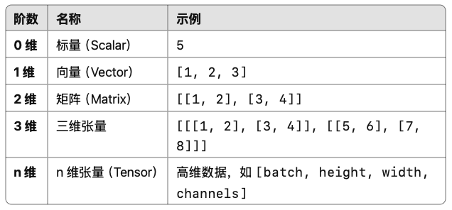

# MLX (Machine Learning eXchange) - GuideBook

## 一、 基于Apple Silicon芯片通过 Metal GPU 进行计算的框架

## 二、 主体分为 $ mlx.core $ 和 $ mlx.nn $ 两个部分: 
### (1) $ mlx.core $ 用于处理**低级张量运算**，类似于 $ numpy $ 或 $ Pytorch $ 中的 $ torch $ 低级API，主要用于张量计算、线性代数、自动微分等。
### (2) $ mlx.nn $ 用于**构建神经网络模块**，类似于 $ Pytorch $ 的 torch.nn 或 TensorFlow 的 tf.keras.layers。提供各种神经网络层 (如Linear、Conv2d、BatchNorm)、激活函数、优化器等，简化深度学习模型的搭建。

## 三、 $ mlx.core $ 的相关功能:
### 1. $ mlx.core.array $ 系列
> 1. mlx.core.array(val, dtype=None)  
> \- 用于多维数组(张量)的表示
>> $ val $ 表示需要转化为array的数据;  
>> $ dtype $ 表示指定数据类型，如float64、int32，不指定会自动推断
```python
import mlx.core as mx
a = mx.array(val=[1, 2, 3], dtype=mx.int32)
print(a)
```
<br>

> 2. mlx.core.array.astype(dtype=None, stream=None)  
> \- 用于转化mlx.core.array的数据类型
>> $ stream $ 表示指定的加速固件，如gpu
```python
import mlx.core as mx
a = mx.array(val=[1.2, 2.3, 3.4], dtype=mx.float32)
b = a.astype(mx.int32)
print(a)
print(b) # 发生位截断
```
<br>

> 3. mlx.core.array.at()  
> \- 更新指定索引在对应张量中的数据
```python
import mlx.core as mx
a = mx.array(val=[1.2, 3.2, 6.5], dtype=mx.float32)

print(a[1])
a = a.at[1].add(2)
print(a[1])
```
<br>

> 4. mlx.core.array.item()  
> \- 将mlx中表示的0维标量转化为python中标准的标量
```python
import mlx.core as mx
a = mx.array(val=5.8, dtype=mx.float32)
print(a.item())
```
<br>

> 5. mlx.core.array.tolist()  
> \- 将mlx中表示的张量转化为python中标准的张量
```python
import mlx.core as mx
a = mx.array(val=[5, 8.8, 4.3, 7.1], dtype=mx.float32)
print(a.tolist())
```
<br>

> 6. mlx.core.array.dtype  
> \- 返回mlx中array的dtype类型

<br>

> 7. mlx.core.array.itemsize  
> \- 返回mlx中数组的大小
```python
import mlx.core as mx
a = mx.array(val=[5, 8.8, 2.3, 5,8], dtype=mx.float32)
print(a.itemsize)
```
<br>

> 8. mlx.core.array.nbytes  
> \- 返回mlx中数组占用的总字节数
```python
import mlx.core as mx
a = mx.array(val=[5, 8.8, 2.3, 5,8], dtype=mx.float32)
print(a.nbytes)
```
<br>

> 9. mlx.core.array.ndim  
> \- 返回mlx中数组的维度

<br>

> 10. mlx.core.array.shape  
> \- 返回mlx中数组的结构
```python
import mlx.core as mx
a = mx.array(val=[[5, 8.8], [2.3, 5,8]], dtype=mx.float32)
print(a.shape)
```
<br>

> 11. mlx.core.array.size
> \- 返回mlx中数组中元素的个数

<br>

> 12. mlx.core.array.abs
> \- 返回mlx中数组中所有元素求绝对值后的数组

<br>

> 13. mlx.core.array

### 2.  

## 四、补充说明
### 1. 张量(Tensor)：多维数组的泛化，是扩展了标量(0d)、向量(1d)、矩阵(2d)的一种数据结构，用于表示任意维度的数值集合。
<p align="center">
  
</p>